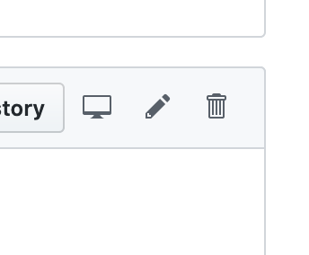
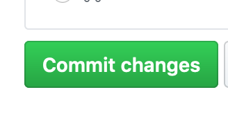
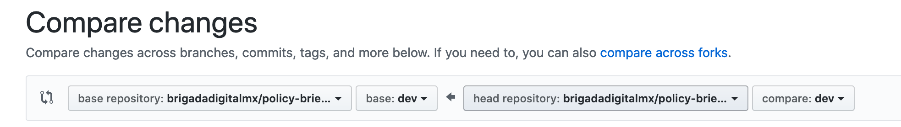
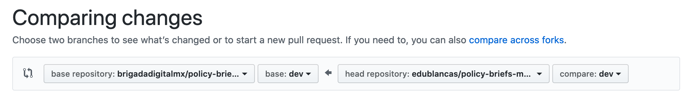
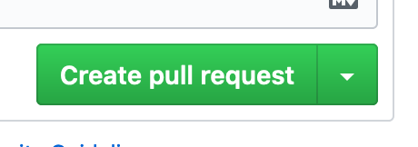

# Contribuciones

Todas las contribuciones se hará usando este repositorio.

## Formato para variables médicas

El principal objectivo de este proyecto es construir una base de datos con variables médicas para que puedan usarse para toma de decisiones y/o modelado. Algunas de estas variables (tasa de mortalidad, por ejemplo) pueden ser calculadas directamente de datos existentes, en otros casos, hay que revisar literatura y extraer los números de los artículos.

Cada una de las variables médicas estará alojada en un folder (ejemplo: `variables/mortalidad`), dentro de ese folder, seguiremos la siguient estructura.

* brief.md - Reporte en formato Markdown con la revisión de la literatura. El título del archivo debe ser el nombre de la variable, debe haber también un subsección con las fuentes citadas
* `src/` - Si se extraen archivos usando algún script, todo el código deberá estar en este folder. El código no debe asumir que ninguna conjunto de datos está presente, deberá descargarlos de internet y poder ejecutarse con un comando (ejemplo: `python analysis.py`). **Importante: No subir datos al repositorio**
* README.md - Archivo markdown con instrucciones generales para correr el código

*Nota: El folder [example/](example) incluye una estructura base siguiendo los lineamientos descritos.*

## Cómo contribuir

*Nota: si tienes experiencia usando Github or git desde la línea de comandos, la versión corta es que los cambios de harán a través de forks y pull requests al branch `dev`.*

1. Crea un fork de este repositorio dando click en el botón  en la esquina superior derecha
2. Esto creará una copia del repositorio en tu cuenta, se verá así: 

3. Edita los archivos a los que quieras contribuir, por ejemplo, si estás trabajando en la variable de periodo de incubación, usando Github, navega hacia el archivo `variables/periodo-de-incubación/brief.md`, puedes editar el archivo directamente presionando en el botón con el símbolo del lápiz 
4. Para guardar tus cambios presiona Commit Changes: 
5. Hasta este momento tus datos han sido guardados en tu copia del repositorio, para incorporarlos en el repositorio original tienes que abrir un Pull Request

## Abriendo un Pull Request

Al momento se hacer el fork, Github copiará el repositorio original, pero los cambios que se haga después de hacer el fork no se reflejarán en tu copia. Para sincronizarla, [sigue estas instrucciones](https://www.sitepoint.com/quick-tip-sync-your-fork-with-the-original-without-the-cli/). **Antes de hacer un Pull Request, verifica que tu fork y el repositorio original están sincronizados**

1. Para incorporar tus cambios, abre el [repositorio original](https://github.com/brigadadigitalmx/policy-briefs-medical) y haz click en 
2. Después da click en *compare across forks*
3. Esto desplegará un menú como el siguiente:
4. Asegúrate de que del lado derecho aparece el repositorio original en el branch dev y que del lado derecho aparezca tu fork. Puedes dar click en las opciones para hacer estos cambios: 

5. Si no hay conflictos, se mostrará un indicador verde. 
6. Si existen conflictos, asegúrate de sincronizar tu fork con el repositorio original. Mantén tus cambios dentro del folder de la variable médica que estás trabajando, si editas archivos fuera de ese folder, es muy probable que haya dificultades para incorporar tus cambios en el repositorio original.
7. Agrega una breve descripción de los cambios y da click en 
8. ¡Listo! Uno de los coordinadores revisará los cambios, y de ser aprobados, serán incorporados al repositorio original.